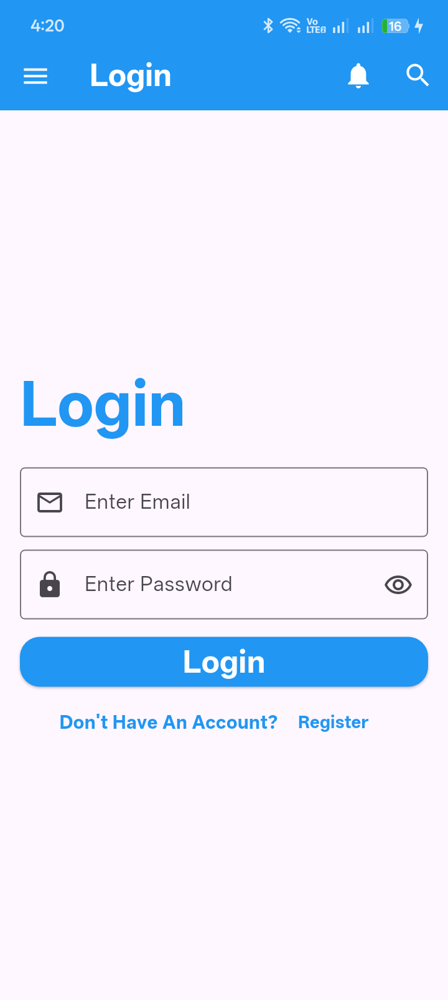

# 🔐 Login UI Design


A clean and modern **Flutter Login UI** built to practice form handling, reusable widgets, custom styling, and responsive layouts.

This project focuses on creating a professional login screen using Flutter best practices and reusable UI components.

---

## 📱 Preview

<p align="center">
  
</p>

---

## 🎯 Project Objectives

- Practice building login interfaces using Flutter.
- Learn how to use `TextFormField`.
- Build reusable UI components.
- Handle user input using `TextEditingController`.
- Practice Flutter layouts and responsive design.

---

## ✨ Features

- 📧 Email input field
- 🔒 Password input field
- 👁️ Password visibility icon
- 🔘 Login button
- 📝 Register button
- 🎨 Clean Material Design UI
- ♻️ Reusable custom widgets
- 📱 Responsive layout using `SingleChildScrollView`

---

## 🛠️ Technologies Used

- Flutter
- Dart
- Material Design
- TextFormField
- TextEditingController
- StatelessWidget
- Custom Widgets

---

## 📂 Project Structure

```text
login-design/
├── lib/
│   ├── main.dart
│   ├── login_view.dart
│   └── widget/
│       ├── font_style.dart
│       ├── icon_style.dart
│       └── style_text_form_field.dart
│
├── assets/
│   └── images/
│       └── Screenshot_login_view.png
│
├── pubspec.yaml
└── README.md
```

---

## 📋 Prerequisites

Before running this project, make sure you have:

- Flutter SDK (3.0.0 or later)
- Android Studio or Visual Studio Code
- Flutter & Dart extensions installed

---

## 🚀 Getting Started

### Clone the repository

```bash
git clone https://github.com/youssefmohamedflutter/login-design.git
```

### Navigate to the project directory

```bash
cd login-design
```

### Install dependencies

```bash
flutter pub get
```

### Run the application

```bash
flutter run
```

---

## 📚 What I Learned

Through this project I learned how to:

- Build reusable Flutter widgets
- Use `TextEditingController`
- Create custom `TextFormField` widgets
- Handle user input
- Organize Flutter projects into multiple files
- Build responsive login screens

---

## 👨‍💻 Author

**Youssef Gado**

Flutter Developer

- 💼 LinkedIn: https://www.linkedin.com/in/youssef-gado-7a2891423/
- 💻 GitHub: https://github.com/youssefmohamedflutter

---

## ⭐ Support

If you like this project, don't forget to leave a ⭐ on the repository.

---

## 📄 License

This project is licensed under the **MIT License**.
